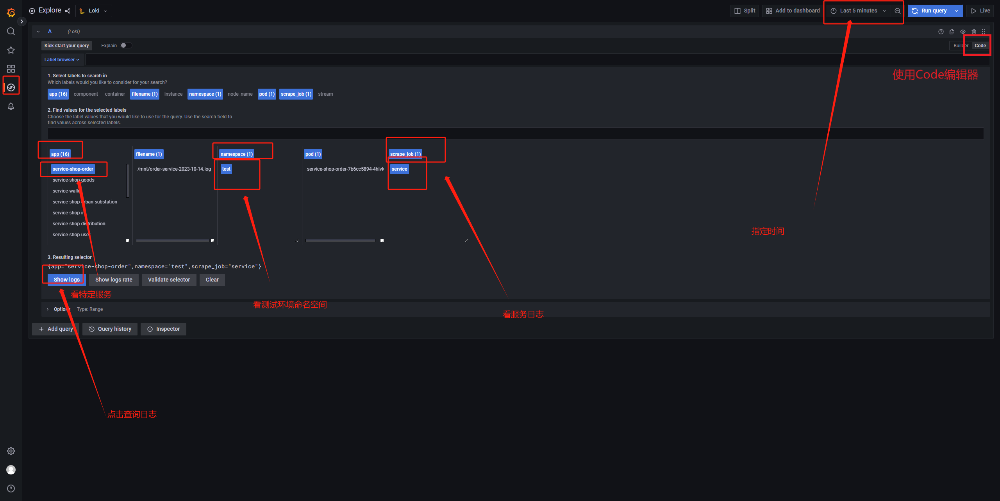
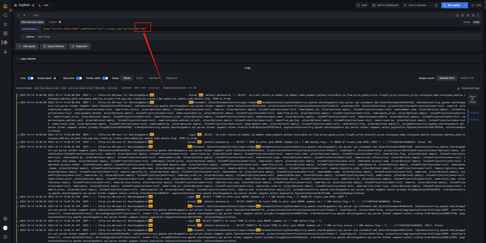
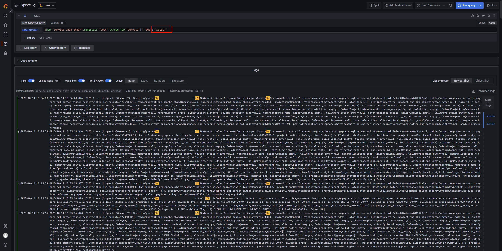
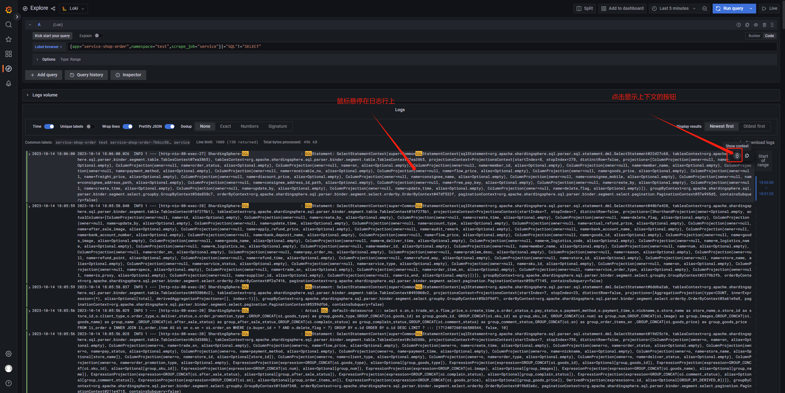
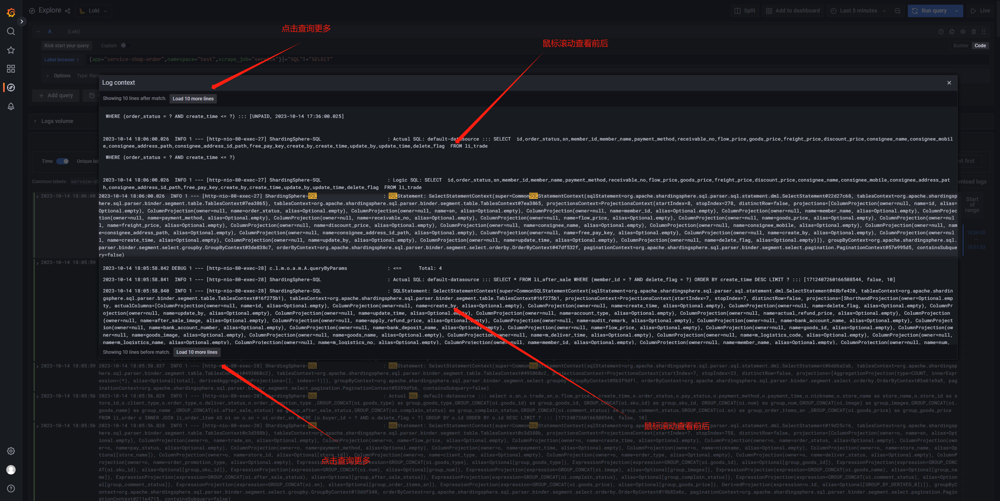

# 目标

查询 指定环境 指定服务 指定时间 的 指定日志


# 登陆grafana

http://grafana.local.your-domain-name.com/explore?orgId=1&left=%7B%22datasource%22:%22PuUG2-e4k%22,%22queries%22:%5B%7B%22refId%22:%22A%22,%22datasource%22:%7B%22type%22:%22loki%22,%22uid%22:%22PuUG2-e4k%22%7D%7D%5D,%22range%22:%7B%22from%22:%22now-1h%22,%22to%22:%22now%22%7D%7D

# 查询 指定环境 指定服务 指定时间 的 指定日志

例如

```
{app="service-shop-payment",namespace="test",scrape_job="service"}
```

| 指标名     | 含义     | 可选值                                   |
| ---------- | -------- | ---------------------------------------- |
| scrape_job | 日志类型 | service: 业务, kubernetes-pods: 容器日志 |
| namespace  | 命名空间 | 目前可以不选, 域名已经隔离了             |
| app        | 服务名称 |                                          |





# 包含查询

在查询表达式里面加上`|="SQL"` 去查询包含指定字符串的日志




# 不包含查询

在表达式里面加上 `!="SELECT"` 去查询不包含指定字符串的日志




# 查看过滤之后的日志的上下文





